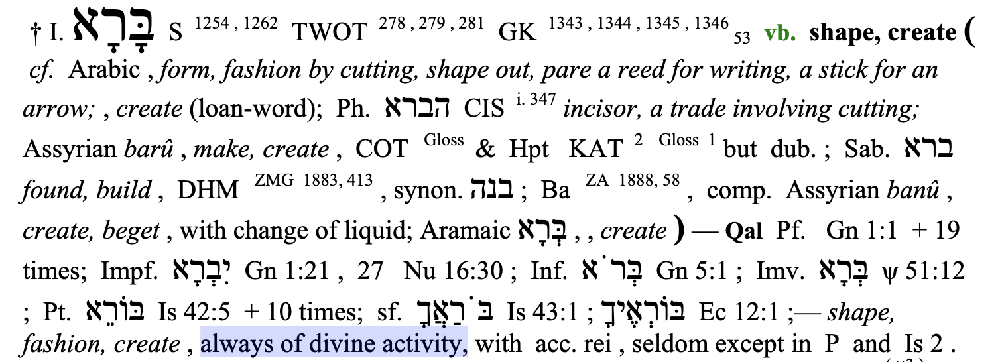

<!-- README.md is generated from README.Rmd. Please edit that file -->

```{r, include = FALSE}
knitr::opts_chunk$set(
  collapse = TRUE,
  comment = "#>",
  fig.path = "man/figures/README-",
  out.width = "100%"
)
```

# barah

<!-- badges: start -->


<!-- badges: end -->



The goal of barah is to bring order to messily-formatted data.

## Installation

You can install the released version of barah from GitHub with:

``` r
remotes::install_github("daranzolin/barah)
```

## Example: Formatting phone numbers

Data and phone numbers come in messy, unpredictable formats. The fashion function helps you sift through the chaos:

```{r}
library(barah)
fashion(c(1234567890, 0987654321), pattern = "(XXX) XXX-XXXX")
```

Pass a regex to the ignore parameter in extreme cases:

```{r}
fashion(c("DCZ123D456C7890Z", "123   142D1234"), "(XXX) XXX-XXXX", ignore = "[DCZ]| ")
```

barah is built with Rcpp, so it *should* be faster than some native R solutions I've seen.

# About the name

I considered just about every creative, input-output verb in the English language, but nothing quite stuck. And so I reached--perhaps blasphemously--beyond English for the Hebrew verb barah. Barah captures the kind of creative forming/molding/shaping/fashioning of something out of chaos. And hilariously, the subjects of sentences with barah are always divine (see above). I'll attribute this to the absolutely divine power of Rcpp, which undergirds the package. 
